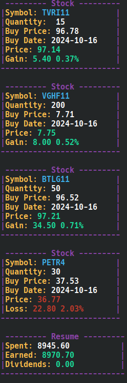

# My Homemade Stocks Analysis Tool
## Description
Its a python script to analyze stocks data from Yahoo Finance. It uses the yfinance library to fetch the data, it intends to provide a simple way to analyze the owned stocks and to help in the decision-making process.

## Features
It has some features under development, but for now the main feature are:
- List all the stocks in the portfolio
it scan all stocks in the portfolio and print some usefull infos in a fast reading way.

## Planned Features
- small ascii plot for each stock
- find top 5 stocks to purchase
- use b3 api to get the own stocks
- add all in a container to run in a server

